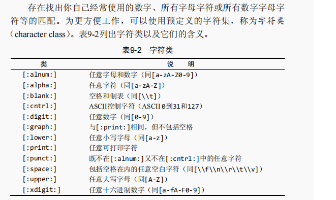
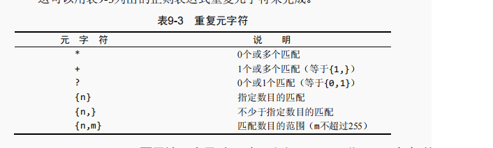
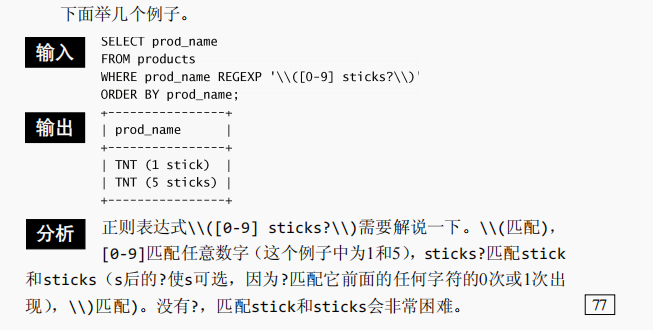
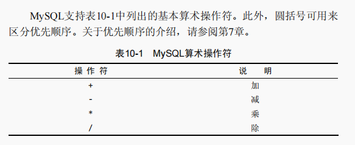
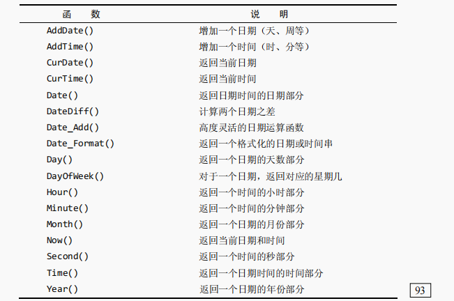
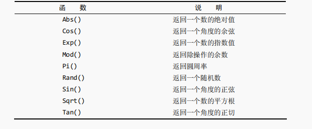
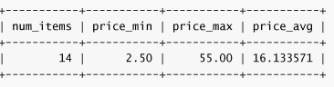
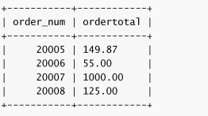
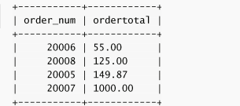
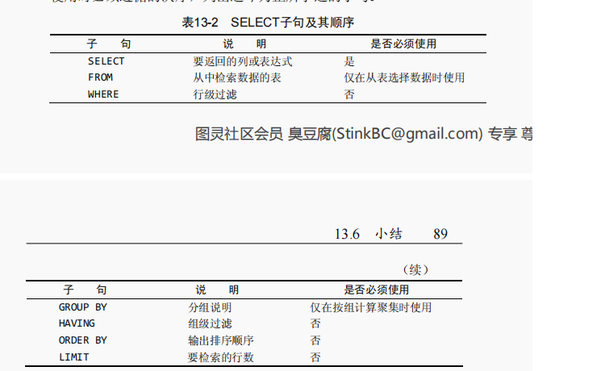

# MySQL学习

## 一、检索数据

1、检索单个列

```sql
select prod_name from products;
```

2、检索多个列

```sql
select prod_id, prod_name，prod_price from products;
```

3、检索所有列

```sql
select * from products;
```

4、检索不同的行（去重）

```sql
select distinct vend_id from products;
```

> *不能部分使用DISTINCT DISTINCT关键字应用于所有列而不仅是前置它的列。如果给出SELECT DISTINCT vend\_id,prod\_price，除非指定的两个列都不同，否则所有行都将被检索出来*

5、限制结果

```sql
select prod_name from products limit 5;
```

## 二、排序检索数据

```sql
select prod_name from products order by prod_name; //单个排序

select prod_name from products order by prod_name, prod_price; //按多个列排序

select prod_id, prod_price, prod_name from products order by prod_price DESC; //指定排序顺序,DESC降序，默认增序ASC

select prod_price from products order by prod_price DESC limit 1; //组合查询
```

## 三、过滤数据

1、使用where字句

```sql
select prod_name ,prod_price from products where prod_price = 2.50; //检查单个值 =
select vend_id, prod_name from products where wen_id <> 1003;// 不匹配检查 <>或者!=
select prod_name,prod_price from products where prod_price between 5 and 10;  //范围值检查 between
select prod_name from products where prod_price is NULL;// 空值检查 NULL
```

## 四、数据过滤

```sql
select prod_id,prod_price,prod_name from proudtcs where vend_id =1003 and prod_price <= 10;// 数据过滤 AND操作符
select prod_id,prod_price,prod_name from proudtcs where vend_id =1003 or prod_price <= 10;// 数据过滤 OR操作符
```

*AND操作符次序优先级高于OR操作符*

```sql
select prod_name,prod_price from products where vend_id in (1002, 1003) order by prod_name; //IN操作符指定条件范围
select prod_name,prod_price from products where vend_id not in (1002, 1003) order by prod_name;//NOT操作符
```

## 五、使用通配符进行过滤

1、LIKE操作符

> 通配符（wildcard） 用来匹配值的一部分的特殊字符。
>
> 搜索模式（search pattern）
>
> ① 由字面值、通配符或两者组合构
>
> 成的搜索条件。

*百分号（%）通配符，%表示任何字符出现任意次数*

```sql
select prod_id, prod_name from products where prod_name like 'jet%'; //找出所有以词jet起头的产品
```

下划线（_）通配符，下划线只匹配单个字符而不是多个字符

```sql
select prod_id,prod_name from products where prod_name LIKE '_ ton anvil';
```

1. 在确实需要使用通配符时，除非绝对有必要，否则不要把它们用
2. 在搜索模式的开始处。把通配符置于搜索模式的开始处，搜索起来是最慢的。
3. 仔细注意通配符的位置。如果放错地方，可能不会返回想要的数据

## 六、使用正则表达式进行搜索

1、基本字符匹配

```sql
select prod_name from products where prod_name regexp '1000' order by prod_name; //除了关键字LIKE被REGEXP替代
```

2、进行OR匹配

```sql
select prod_name from products where prod_name regexp '1000|2000' order by prod_name;// 使用|
```

3、匹配几个字符之一

```sql
select prod_name from  products where prod_name REGEXP '[123] TON'
```

4、匹配范围

集合可以用来定义要匹配的一个或者多个字符，下面的集合将匹配数字0到9：[0123456789]

```sql
select prod_name from products where prod_name REGEXP '[1-5] Ton'; //-用来匹配范围
```

5、匹配特殊字符

```sql
select vend_name from vendors where vend_name REGEXP '.' order by vend_name;// . 匹配任意字符
```

*如果要匹配.这种特殊字符，要是有\\\\为前导*

6、匹配字符类



7、匹配多个实例



下面是例子



8、定位符

1. ^   匹配文本的开始
2. $    匹配文本的结尾
3. [[:,:]]  词的开始
4. [[:>:]]  词的结尾

## 七、创建计算字段

1、计算字段

计算字段并不实际存在于数据库表中。计算字段是运行时在SELECT语句内创建的。

2、拼接字段

```sql
select concat(vend_name, '(', vend_country, ')') from vendors order by vend_name; //concat拼接,把多个串连接起来形成一个较长的串
```

3、使用别名

```sql
select concat(vend_name, '(', vend_country, ')') AS vend_title from vendors order by vend_name; //使用AS赋予别名
```

4、执行计算字段

```sql
select prod_id,quantity,item_price,quantity*item_price AS expanded_price from orderitems where order_num = 20005;
```



## 七、使用数据处理函数

1、函数

文本处理函数：

RTrim() 去除串尾字符串

Upper() 将文本转换成大写

Left() 返回串左边的字符

Locate()找出串的一个子串

Length() 返回串的长度

Lower() 将串转换为小写

```sql
select vend_name,Upper(vend_name) AS vend_name_upcase from vendors order by vend_name;
```

日期和时间处理函数：

```sql
select cust_id, order_num from orders hwere Date(order_date) = '2005-09-01'; //假如order_dat为2005-09-01 11：30：05，返回日期的天数部分
```




数值处理函数：

数值处理函数仅处理数值数据，这些函数一般主要用于代数，三角或者几何运算



## 八、汇总数据

1、聚焦函数

AVG()  返回某列的平均值

COUNT()  返回某列的行数

MAX() 返回某列的最大值

MIN() 返回某列的最小值

SUM() 返回某列值之和

```sql
select AVG(prod_price) AS avg_price from products;
select COUNT(*) AS num_cust from customers;
```

2、聚集不同值

对上面的5个聚集函数都可以如下使用：

* 对所有的行执行计算，知道ALL参数或不给参数
* 只包含不同的值，指定DISTINCT参数

3、组合聚集函数

```sql
select COUNT(*) AS num_items, MIN(prod_price) AS price_min, MAX(prod_price) AS price_max,AVG(prod_price) AS price_avg from products;
```




## 九、分组数据

1、创建分组

分组是在SELECT语句中的GROUP BY字句中建立的

```sql
SELECT vend_id, COUNT(*) AS num_prods FROM products GROUP BY vend_id;
```

2、过滤分组,使用HAVING

```sql
select cust_id,COUNT(*) AS orders FROM orders GROUP BY cust_id HAVING COUNT(*) >= 2;

select vend_id, COUNT(*) AS num_prods FROM products WHERE prod_price >= 10 GROUP BY vend_id HAVING COUNT(*) >= 2;
```

3、分组和排序

order by        group by

排序产生的输出     分组行，但输出可能不是分组的顺序

任意列可以使用      只可能使用选择列或者表达式列

不一定需要            如果与聚焦函数一起使用列，则必须使用

```sql
select order_num, SUM(quantity*item_price) AS ordertotal FROM orderitems GROUP BY order_num HAVING SUM(quantity*item_price) >= 50;
```




```sql
select order_num, SUM(quantity*item_price) AS ordertotal FROM orderitems GROUP BY order_num HAVING SUM(quantity*item_price) >= 50 ORDER BY ordertotal; //group by后面使用order by排序
```




4、select 字句顺序



## 十、使用子查询

1、子查询

```sql
select cust_id from orders where order_num in (select order_num from orderitems where prod_id = 'TNT2');
```

*在select语句中，子查询总是从内向外处理*

2、作为计算字段使用子查询

```sql
select cust_name, cust_state, (select count(*) from orders where orders.cust.id = customers.cust_id) AS orders from customers order by cust_name;
```

## 十一、使用联结

*外键（foreign key） 外键为某个表中的一列，它包含另一个表的主键值，定义了两个表之间的关系*

创建联结：

```sql
select vend_name, prod_name, prod_price from vendors, products where vendors.vend_id = products.vend_id order by vend_name, prod_name;
```
